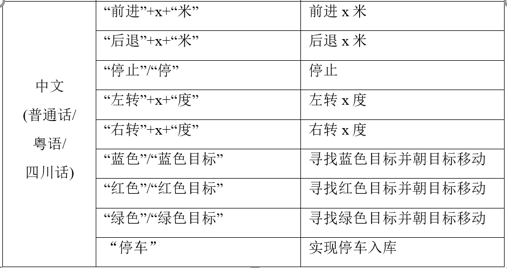

## Readme

### main.m

主文件，包含小车运行基本功能和拓展功能。运行后可进行语音识别，控制小车前进、后退、左转、右转、识别蓝色、绿色、红色物体、倒车功能。

#### ras_control_net.m

使用训练网络实现小车运行基本功能

#### getcolor.m

识别特定颜色的函数，对输入图片进行处理，返回保留特定颜色的图片

#### rbz1.m

红外避障程序

#### turnleft.m、turnright.m

控制小车左转右转

#### NetTraining.m、gkc_net4.mat

训练并验证语音识别卷积神经网络，得到预训练网络gkc_net4

#### deployment_ras.m

将语音识别模块部署到树莓派小车上

## 运行说明

运行main.m文件

在收到begin反馈后，发出语音指令，语音指令种类与小车对应动作如下：

运行结束后使用  **system(mypi,'sudo shutdown -h now');**  将小车关机

